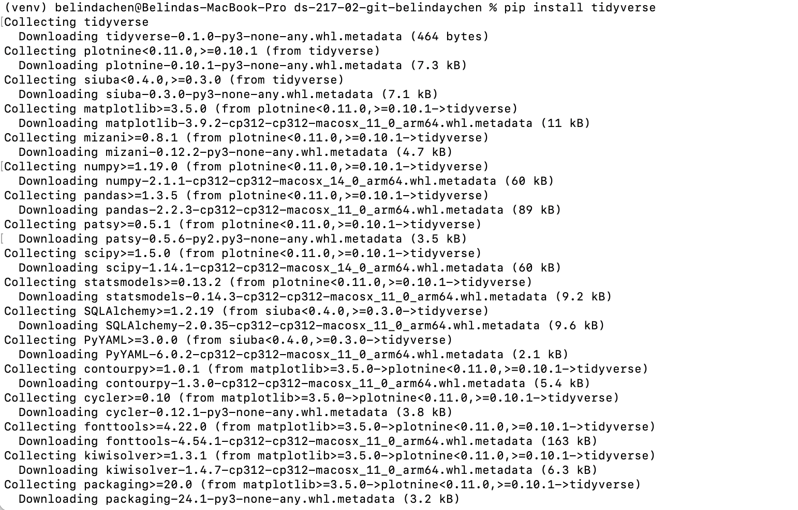

# Assignment 1

# About Me 
I'm Belinda, a first year in the HDS Master's program. 🙂 I graduated from UC Berkeley with a Chemical Biology degree (+ public health and data science minors) in May 2024, and hope to pursue a PhD following the program. I've self-taught myself Git, leetcode, web scraping, etc so I'm looking forward to learning these topics in a formal setting. I am most interested in learning the ML topics to supplement my interest in medical image segmentation.

## Python Installation 
- [Python Official Website](https://www.python.org/)

## Assignment 1 Question
If we list all the natural numbers below 10 that are multiples of 3 or 5, we get (3, 5, 6, 9). The sum of these multiples is 23. Find the sum of all the multiples of 3 or 5 below 1000.
Answer: 233168
The script can be found in the assignment01.py file.

## Package Installation Screenshot: Tidyverse

## Internet meme that I like 
There has been this baby Thai hippo named "Moo Deng" (translated to Chubby Pig) that's been going viral on the internet right now, and I hold so much affection for him 
 

